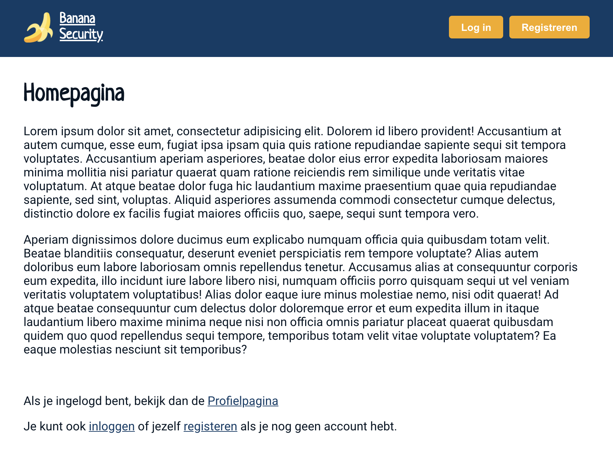

# Opdrachtbeschrijving

## Inleiding

Vorige week heb je het toonaangevende bedrijf Banana Security geholpen met het opzetten van een beveiligde omgeving,
waarin gebruikers konden inloggen. En hoewel de implementatie hartstikke goed is, is daar ook gelijk alles mee gezegd:
je kunt namelijk **alleen in- en uitloggen**. Gebruikers hebben geen accounts en kunnen ook geen accounts aanmaken...
Maar omdat Banana Security tot nu toe ontzettend blij met je is (je bent immers een stuk sneller
dan [Tim](https://speld.nl/2016/01/08/icter-tim-ging-een-jaar-offline-en-nu-is-hij-ontslagen/)) hebben ze je nogmaals
ingehuurd om de inlog-omgeving helemaal te professionaliseren.



## Applicatie starten

Als je de opdracht van vorige week afgemaakt hebt, kun je gewoon verder werken in jouw eigen project. Wacht echter nog
even met het opstarten van jouw project.

Clone eerst de [nep database server](https://github.com/hogeschoolnovi/frontend-fake-server) naar jouw lokale machine.
Voor je de server kunt gebruiken zul je de dependencies moeten installeren met het commando:

```shell
npm install
```

Om de server te starten hoef je slechts het volgende commando in jouw terminal in te voeren:

```shell
npm run json:server
```

Deze server draait op [http://localhost:3000](http://localhost:3000/), wanneer je dit in de browser opent zul je alle
beschikbare endpoints zien verschijnen. **Let op**: omdat deze server op `localhost:3000` draait is het belangrijk deze
server te starten vóór je een React-project start. React zal dan automatisch vragen om dat project op een andere poort
te draaien.

## Randvoorwaarden

De applicatie heeft op dit moment al vier pagina's, een beveiligde route en een Context de gebruikers in- en uitlogt. Om
het gebruik van een backend voor het opslaan van gebruikersgegevens en uitgifte van een JWT te veinzen, gebruiken we een
nep database server. Dit is niets meer dan een javascript projectje die zich, doormiddel van een npm package genaamd
`json-server-auth`, gedraagt als een backend met REST endpoints wanneer je het project runt. Je kunt het
project [hier](https://github.com/hogeschoolnovi/frontend-fake-server)
clonen. In de README.md van het project staat beschreven hoe je de server kunt starten en welke endpoints er beschikbaar
zijn. Lees deze documentatie grondig door.

### 1. Uitbreiden van Context-state

Je gaat de state uitbreiden met een `user` key. Dat ziet er zo uit:

```javascript
const [isAuth, toggleIsAuth] = useState({
  isAuth: false,
  user: null,
});
```

**Let op:** dat betekent ook dat je de `toggleIsAuth`-functies anders moet aanroepen en ervoor moet zorgen dat beide
keys worden meegegeven in het context-data-object!

### 2. Registreren

Een gebruiker kan een nieuw account aanmaken door de invoervelden _emailadres_, _wachtwoord_ en _gebruikersnaam_ in te
voeren in het registratieformulier. Dit account wordt in de fake server opgeslagen (
zie [documentatie](https://github.com/hogeschoolnovi/frontend-fake-server#registreren) over het `/register` endpoint).

### 3. Inloggen

Na een succesvolle registratie wordt de gebruiker doorgestuurd naar de login-pagina. De gebruiker kan inloggen door de
invoervelden _emailadres_ en _wachtwoord_ in te vullen. Deze gegevens worden vervolgens naar de fake server gestuurd.
Een gebruiker is ingelogd wanneer de fake server jouw POST-request beantwoordt met een JWT (
zie [documentatie](https://github.com/hogeschoolnovi/frontend-fake-server#inloggen) over het `/login` endpoint).

In de Context gebeurt vervolgens het volgende:

1. De JWT wordt in de Local Storage geplaatst;
2. `isAuth` wordt op `true` gezet;
3. De gebruikersgegevens worden opgevraagd van de fake-server en in de Context-state gezet onder `user` (
   zie [documentatie](https://github.com/hogeschoolnovi/frontend-fake-server#gebruikersdetails-opvragen) over
   het `/600/users/:id` endpoint). Hiervoor zul je de token eerst moeten decoderen;
4. De gebruiker wordt doorgestuurd naar de profielpagina.

### 4. Uitloggen

Wanneer de gebruiker uitlogt, gebeurt het volgende:

1. De JWT wordt uit de Local Storage gehaald;
2. `isAuth` wordt op `false` gezet;
3. `user` wordt weer `null`;
4. De gebruiker wordt doorgestuurd naar de homepagina.

### 5. Persist on refresh

Je gaat de state uitbreiden met een `status` key. Dat ziet er zo uit:

```javascript
const [isAuth, toggleIsAuth] = useState({
  isAuth: false,
  user: null,
  status: 'pending',
});
```

*Tip:* Pak vooral [hoofdstuk 10.3](https://edhub.novi.nl/study/courses/516/content/12828) van de cursus React op EdHub
erbij als houvast voor de implementatie van persist on refresh. Wanneer de applicatie opnieuw geladen wordt, gebeurt het
volgende:

1. Wanneer de applicatie is gemount, wordt er gecheckt of er een token aanwezig is in de Local Storage;
2. Als dat zo is, zul je de token moeten decoderen om de gebruikersdata op te kunnen vragen  (
   zie [documentatie](https://github.com/hogeschoolnovi/frontend-fake-server#gebruikersdetails-opvragen) over
   het `/600/users/:id` endpoint)
3. Indien het opvragen van de data succesvol is, doe je het volgende:
    1. Zet de data onder de `user`-key in de Context-state;
    2. Zet `status` op `done`;
    3. Zet de `isAuth` op `true`;
4. Indien het opvragen van de data niet succesvol is of er is geen token aanwezig, doe je het volgende:
    1. Zet `user` op `null`;
    2. Zet `status` op `done`;
    3. Zet de `isAuth` op `false`;
5. De `children` van de Context-Provider worden niet gerendered zolang de status niet op `done` staat. In dat geval
   renderen we `<p>Loading...</p>`;

### 6. Beschermde profieldata ophalen

Je implementeert het ophalen van de gebruikersgegevens op de profielpagina. Het *emailadres* en *gebruikersnaam* lees je
uit de Context. De "Strikt geheime profiel-content" vraag je op middels een request naar het beveiligde endpoint (zie
documentatie over het `/660/private-content` endpoint).

## Stappenplan

Als je niet zo goed weet waar je moet beginnen, kun je onderstaand stappenplan volgen:

1. Start de fake-server (zodat hij op port 3000 draait) en daarna pas jouw eigen project.

2. Breidt de Context-state uit met een `user`-key. Vergeet niet om het context-data object zo aan te passen dat zowel de
   property `user` als de property `isAuth` worden meegegeven!

   ```javascript
   const [isAuth, toggleIsAuth] = useState({
     isAuth: false,
     user: null,
   });
   ```

3. Geef het registratie-formulier drie invoervelden (*emailadres*, *wachtwoord* en *gebruikersnaam*) doormiddel van
   Controlled Components of React Hook Form. Zorg dat de ingevulde waardes in de console gelogd wordt als de gebruiker
   op de submit-knop drukt.

4. Installeer Axios!

5. Maak een POST-request naar het registratie-endpoint en stuur de ingevulde data mee. Lees de documentatie over
   het [registratie-endpoint](https://github.com/hogeschoolnovi/frontend-fake-server#registreren) goed door om te zien
   hoe de informatie aangeleverd moet worden!

6. Krijg je een succesmelding? Zorg je dat de gebruiker wordt doorgelinkt naar de login pagina;

7. Geef het login-formulier twee invoervelden (_emailadres_ en _wachtwoord_) doormiddel van Controlled Components of
   React Hook Form. Zorg dat de ingevulde waardes in de console gelogd wordt als de gebruiker op de submit-knop drukt.

8. Na het loggen van de waardes maak je een POST-request naar het login-endpoint en stuur je de ingevulde data mee. Lees
   de documentatie over het [login-endpoint](https://github.com/hogeschoolnovi/frontend-fake-server#inloggen) goed door
   om te zien hoe de informatie aangeleverd moet worden!

9. Als je dit goed hebt gedaan, krijg je een JWT terug. Geef deze mee aan de huidige `login`-functie van de Context;

10. Open jouw `AuthContext`-bestand. Zorgt ervoor dat jouw `login` de token ook daadwerkelijk *ontvangt*;

11. Zorg ervoor dat de `login`-functie de JWT in de Local Storage plaatst;

12. Installeer de `jwt-decode` package en decodeer de token. We namelijk hebben de `id` van de gebruiker nodig!

13. Gebruik deze `id` en de versleutelde token om een GET-request te doen naar het gebruikersgegevens-endpoint. Lees de
    documentatie over
    het [gebruikersdetails-endpoint](https://github.com/hogeschoolnovi/frontend-fake-server#gebruikersdetails-opvragen)
    goed door om te zien hoe de informatie aangeleverd moet worden!

14. Als dit succesvol is, gebruik je de response om de gebruikersgegevens in de Context-state te plaatsen. Bovendien zet
    je  `isAuth` op `true`:

```javascript
setAuthState({
  isAuth: true,
  user: {
    username: 'Piet',
    email: 'pieter@gmail.com',
    id: 23,
  },
});
```

15. Ten slotte link je de gebruiker door naar de profielpagina.

16. Nu kun je de `uitlog`-functie ook uitbreiden. Daarin moet het volgende gebeuren:

    1. De JWT wordt uit de Local Storage gehaald;
    2. `isAuth` wordt op `false` gezet;
    3. `user` wordt weer `null`;
    4. De gebruiker wordt doorgestuurd naar de homepagina.

17. Test het registereren, vervolgens inloggen en daarna uitloggen door dit als gebruiker te doorlopen. Werkt alles nog
    naar behoren?

18. Breidt de Context-state uit met een `status`-key:

    ```javascript
    const [isAuth, toggleIsAuth] = useState({
      isAuth: false,
      user: null,
      status: 'pending',
    });
    ```

19. Implementeer een *mounting*-effect in de context. Zorg ervoor dat er `Context wordt gerefresht!` wordt gelogd in de
    console wanneer je de applicatie ververst. In dit mounting-effect doe je de volgende dingen:

    1. Check of er een JWT in de Local Storage aanwezig is
    2. Als dat zo is, decodeer je de token. We namelijk hebben de `id` van de gebruiker nodig!
    3. Gebruik deze `id` en de versleutelde token om een GET-request te doen naar het gebruikersgegevens-endpoint.
    4. Als dit succesvol is, gebruik je de response om de gebruikersgegevens in de Context-state te plaatsen. Bovendien
       zet je  `isAuth` op `true` en de `status` op `done`.
    5. Als dit niet succesvol is of er is geen token aanwezig, zet je de de `user` op `null`, `isAuth` op `false`
       en `status` op `done`

20. Zet een ternary operator in de return-statement van de Context. Render alleen de `children` wanneer de status
    op `done` staat, anders renderen we  `<p>Loading...</p>`;

21. Open de profielpagina. Lees de `gebruikersnaam` en `emailadres` uit uit de Context met behulp van de `useContext`
    -functie.

22. Geef deze gegevens weer op de Profielpagina waar nu de hard-coded tekst staat

23. Implementeer hier ook een *mounting*-effect. In dat mounting effect doen we een GET-request naar het
    private-content-endpoint. Lees de documentatie over
    het [private-content-endpoint](https://github.com/hogeschoolnovi/frontend-fake-server#afgeschermde-data-opvragen)
    goed door om te zien wat je mee moet sturen.

24. Maak een stukje state aan op de profielpagina. Zet de data die je terugkrijgt in deze state, zodat je het kunt
    weergeven op de pagina!

## Bonus-opdrachten

* Check tijdens de persist on refresh ook of de token nog geldig is. *Tip*: schrijf hier een helper-functie voor
  die `true` of `false` returned.
* Implementeer *unmounting*-effecten op de registreer-, inlog- en profielpagina door het request te annuleren met een
  Axios Canceltoken. Hoe je dit doet, vindt je in [hoofdstuk 7.4](https://edhub.novi.nl/study/courses/516/content/12791)
  van de cursus React op EdHub.